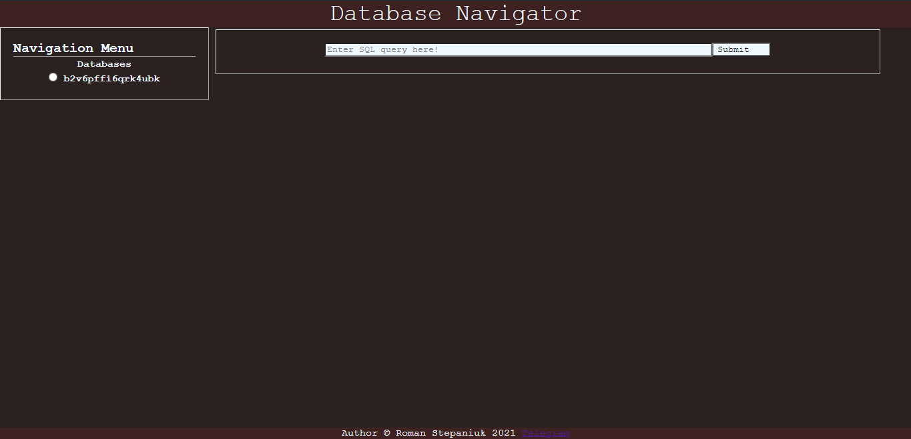
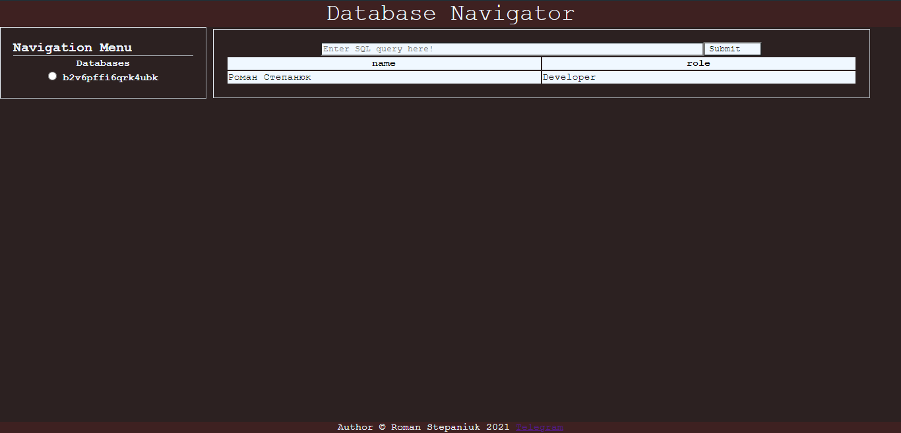
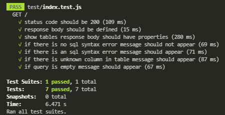

## Зміст

 1. [Вступ](#вступ)
 2. [Основні визначення](#основні-визначення)
 3. [Технічне завдання](#технічне-завдання)
 4. [Проектування](#проектування)
 5. [Розробка](#розробка)
 6. [Тестування](#тестування)
 7. [Висновки](#висновки)

## Вступ

**Тема проекту:** "Онлайн-навігатор бази даних MySQL"  
Онлайн застосунок для перегляду та навігації базами даних

**Метою** документа є визначення основних вимог до функціональності, практичності, продуктивності і експлуатаційної придатності, а також характеристика процесів та факторів, що впливають на предмет розробки.

### Основні визначення
[База даних](https://uk.wikipedia.org/wiki/%D0%91%D0%B0%D0%B7%D0%B0_%D0%B4%D0%B0%D0%BD%D0%B8%D1%85) - сукупність даних, організованих відповідно 
до концепції, яка описує характеристику цих даних і взаємозв'язки між їх елементами.

[Запит](https://uk.wikipedia.org/wiki/%D0%97%D0%B0%D0%BF%D0%B8%D1%82) - це формулювання своєї інформаційної потреби користувачем деякої бази 
даних або інформаційної системи, наприклад, пошукової системи. Для складання запиту використовується мова пошукових запитів.

[SQL](https://uk.wikipedia.org/wiki/SQL) (англ. Structured query language - мова структурованих запитів) - декларативна мова програмування 
для взаємодії користувача з базами даних.

[MySQL](https://uk.wikipedia.org/wiki/MySQL) - вільна система керування реляційними базами даних. Ця модель характеризується простотою 
структури даних, зручним для користувача табличним представленням і можливістю використання формального апарату алгебри відношень 
і реляційного обчислення для обробки даних.

[Система управління базами даних](https://uk.wikipedia.org/wiki/%D0%A1%D0%B8%D1%81%D1%82%D0%B5%D0%BC%D0%B0_%D1%83%D0%BF%D1%80%D0%B0%D0%B2%D0%BB%D1%96%D0%BD%D0%BD%D1%8F_%D0%B1%D0%B0%D0%B7%D0%B0%D0%BC%D0%B8_%D0%B4%D0%B0%D0%BD%D0%B8%D1%85)
(англ. Database Management System) - набір взаємопов'язаних даних (база даних) і програм для доступу до цих даних.

### Технічне завдання
**Постановка завдання**

Розробити систему, за допомогою якої користувач може керувати (перегляд, навігація) базами даних.

**Способи вирішення завдання**

**Інтеграція з GitHub**

Інтеграція з GitHub'ом як системою контролю версій: Система контролю версій — це компонент управління програмним забезпеченням, що обробляє та відстежує зміни, внесені до інформації чи програмного забезпечення. Реальні проєкти потребують систему контролю версій через те, що зазвичай над ними працює не одна людина. Тож такі системи гарантують, що в коді та іншій інформації проєкту не буде співпадінь чи конфліктів.

GitHub - безкоштовний сервіс з відкритим сирцевим кодом, що базується на Git та надає віддалений доступ до його репозиторіїв, забезпечує розміщення коду та допомагає в управлінні життєвим циклом розробки програмного забезпечення. Крім того, він містить такі функції, як сумісне використання коду декількома особами, відстеження помилок, та інші інструменти.

### Порівняльна характеристика існуючих засобів вирішення завдання
[MySQLWorkbench](http://mysqlworkbench.org/) - інструмент для візуального проектування баз даних, що інтегрує проектування, моделювання, створення й експлуатацію БД в єдине безкоштовне оточення для системи баз даних MySQL. 

MySQL Workbench пропонується в двох редакціях:
- Community Edition — поширюється під вільною ліцензією GNU GPL
- Standard Edition — доступна за щорічною передплатою. Ця версія включає в себе додаткові функції, які підвищують продуктивність розробників та адміністраторів БД.

Можливості програми:
- Дозволяє наочно представити модель бази даних в графічному вигляді.
- Наочний і функціональний механізм установки зв'язків між таблицями, в тому числі «багато до багатьох» із створенням таблиці зв'язків.
- Reverse Engineering — відновлення структури таблиць з вже існуючої на сервері БД (зв'язки відновлюються в InnoDB, при використанні MyISAM зв'язки необхідно встановлювати вручну).
- Зручний редактор SQL запитів, що дозволяє відразу ж відправляти їх серверові і отримати відповідь у вигляді таблиці.
- Можливість редагування даних у таблиці в візуальному режимі.

[phpMyAdmin](https://www.phpmyadmin.net/) - веб-додаток з відкритим кодом, написаний мовою PHP із графічним веб-інтерфейсом для адміністрування бази даних MySQL або MariaDB. phpMyAdmin дозволяє через браузер здійснювати адміністрування сервера MySQL, запускати запити SQL, переглядати та редагувати вміст таблиць баз даних. Ця програма користується великою популярністю у веб-розробників, оскільки дозволяє керувати базу даних MySQL без вводу SQL команд через дружній інтерфейс і з будь-якого комп'ютера під'єднаного до інтернету без необхідності встановлення додаткового програмного забезпечення.

[PostgreSQL](https://www.postgresql.org) - об'єктно-реляційна система керування базами даних. Порівняно з іншими проєктами з відкритим кодом PostgreSQL не контролюється якоюсь однією компанією, її розробка можлива завдяки співпраці багатьох людей та компаній, які хочуть використовувати цю СКБД та впроваджувати у неї найновіші досягнення.

Сервер PostgreSQL написаний на мові C. Зазвичай розповсюджується у вигляді набору текстових файлів із сирцевим кодом. Для інсталяції необхідно відкомпілювати файли на своєму комп'ютері і скопіювати в деякий каталог. Весь процес детально описаний в документації.

**Порівняльна таблиця**

|Вимоги| Критерії | MySQLWorkbench | phpMyAdmin | PostgreSQL |
|:----:| :--------------: | :-------------: | :----: |  :----:  |
| **Функціональні** | Кросплатформеність | ✓ | ✓ | ✓ |
|  | Вартість користування | Безкоштовно | Безкоштовно | Безкоштовно |
|  | Лише хмарна платформа | X | X | X |
| **До зручність** | Наявність FAQ/довідки | ✓ | ✓ | ✓ |
|  | Інтуїтивно зрозумілий інтерфейс | ✓ | ✓ | ✓ |
|  | Багатоплатформність | ✓ | ✓ | ✓ |
|  | Багатомовність | ✓ | - | ✓ |
|  | Зручний онлайн-доступ | ✓ | ✓ | ✓ |
| **До надійності** | Захист даних | ✓ | ✓ | ✓ |
|  | Резервне копіювання | ✓ | ✓ | - |
| **До продуктивності** | Швидке виконання запиту | ✓ | ✓ | ✓ |
|  | Миттєва синхронізація | ✓ | ✓ | ✓ |
| **До підтримки** | Своєчасне оновлення даних | ✓ | ✓ | ✓ |

## Проектування

**Діаграма юзкейсів**


**Сценарій №1**

***ID:*** UC_1

***НАЗВА:*** Запит SQL

***УЧАСНИКИ:*** Користувач, система

***ПЕРЕДУМОВИ:*** Відсутні

***РЕЗУЛЬТАТ:*** Відображення результатів обробки запиту

***ВИКЛЮЧНІ СИТУАЦІЇ:***
   - EX.1.1 поле запиту порожнє
   - EX.1.2 помилка у синтаксисі SQL
   - EX.1.3 вказаної таблиці не існує
   - EX.1.4 вказаного поля у таблиці не існує

***ОСНОВНИЙ СЦЕНАРІЙ:***


### Проектування інтерфейсу

**Головна сторінка (порожня)**



**Головна сторінка (з результатами обробки запиту)**



## Розробка 

[Див. документацію коду](https://github.com/rmnstepaniuk/database-navigator/blob/master/README.md#%D0%BF%D0%B5%D1%80%D0%B5%D0%B3%D0%BB%D1%8F%D0%BD%D1%83%D1%82%D0%B8-jsdoc-%D0%B4%D0%BE%D0%BA%D1%83%D0%BC%D0%B5%D0%BD%D1%82%D0%B0%D1%86%D1%96%D1%8E-%D0%BA%D0%BE%D0%B4%D1%83-%D0%BC%D0%BE%D0%B6%D0%BD%D0%B0-%D0%B7%D0%B0-%D0%B4%D0%BE%D0%BF%D0%BE%D0%BC%D0%BE%D0%B3%D0%BE%D1%8E-%D0%BA%D0%BE%D0%BC%D0%B0%D0%BD%D0%B4%D0%B8-npm-run-doc)

## Тестування 

### Тест №1

Тестування коду стану HTTP. Очікується успішне виконання HTTP запиту (200 OK)
```javascript
test("status code should be 200", async done => {
    const response = await request(app).get("/");
    expect(response.statusCode).toBe(200);
    done();
})
```
### Тест №2

Тестування відповіді серверу на запит. Очікується, що відповідь буде визначеною.
```javascript
test("response body should be defined", async done => {
    const response = await request(app).get("/");
    expect(response.body).toBeDefined();
    done();
})
```
### Тест №3

Тестування конкретного SQL запиту. Очікується, що відповідь буде містити потрібні поля.
```javascript
test("show tables response body should have properties", async done => {
    headers = ['access', 'action', 'artifact', 'metadata', 'project', 'task', 'user']

    const response = await request(app).get("/?sql=show%20tables");
    expect(response.text).toContain('Tables_in_b2v6pffi6qrk4ubk');
    headers.forEach(header => {
        expect(response.text).toContain(header);
    })
    done();
})
```

### Тест №4

Тестування відповіді на синтаксично правильний SQL запит. Очікується, що не буде повідомлення про помилку.
```javascript
test("if there is no sql syntax error message should not appear", async done => {
    const response = await request(app).get("/?sql=show%20tables");
    expect(response.text).not.toContain("You have an error in your SQL syntax");
    done();
})
```

### Тест №5

Тестування відповіді на синтаксично неправильний SQL запит. Очікується, що буде повідомлення про помилку.
```javascript
test("if there is an sql syntax error message should appear", async done => {
    const response = await request(app).get("/?sql=sql%20syntax%20error");
    expect(response.text).toContain("You have an error in your SQL syntax");
    done();
})
```

### Тест №6

Тестування відповіді на SQL запит у якому вказане неправильне або неіснуюче поле. Очікується, що буде повідомлення про помилку.
```javascript
test("if there is unknown column in table message should appear", async done => {
    const response = await request(app).get("/?sql=select%20abcd%20from%20user");
    expect(response.text).toContain("Unknown column");
    done();
})
```

### Тест №7

Тестування відповіді на порожній SQL запит. Очікується, що буде повідомлення про помилку.
```javascript
test("if query is empty message should appear", async done => {
    const response = await request(app).get("/?sql=");
    expect(response.text).toContain("Query was empty");
    done();
})
```

**Результати тестування**



## Висновки
Провівши аналіз предметної області, порівнявши переваги та недоліки вже існуючих систем керування базами даних і, враховуючи навчальну направленість проекту, було прийнято рішення створити власний аналог системи управління базами даних.

Посилання на курсову роботу: https://github.com/rmnstepaniuk/database-navigator
